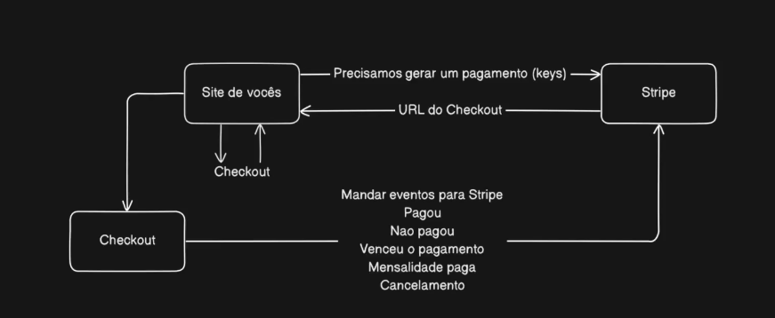

# Challenge Micro Saas NextJs

## To run the app
- `npm run dev`

## Google OAth
- ignite-call-nextjs14
- credentials inside .env
To remove the permission to test again
- https://myaccount.google.com/security?hl=pt >> Third Party Apps

## Google Developer - Credentials
- https://console.cloud.google.com/auth/clients?hl=pt-br&invt=Abu1WQ&project=microsaaschallenge

## Firebase
- https://console.firebase.google.com/project/micro-saas-challenge-nextjs/overview?hl=pt-br

### Encode the Firebase Private Key at:
- remove all `/n`
- https://www.base64encode.org/pt/

## Stripe
- stripe listen --forward-to localhost:3000/api/stripe/webhook

- Settings > Billing > Customer Portal. 
- https://dashboard.stripe.com/settings/billing/portal

- Test Credit Card
- https://docs.stripe.com/testing

## Mercado Pago
- https://www.mercadopago.com.br/developers/panel/app 

## Vercel
- https://vercel.com/dsolderas-projects/challenge-microsaas-nextjs

- Prod URL
- https://challenge-microsaas-nextjs.vercel.app

